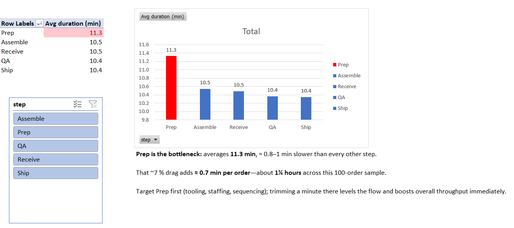

## Bottleneck Dashboard (Excel)

**Goal:** Identify the slowest step in a 5-stage order-fulfilment process  
**Dataset:** 500 rows · columns: order_id · step · duration_min  
**Skills shown:** PivotTables · conditional formatting · charting · summary storytelling  
**Key insight:** "Prep" averages 11.3 min—≈1 min slower than peers, costing ≈1¼ hr per 100 orders.  

